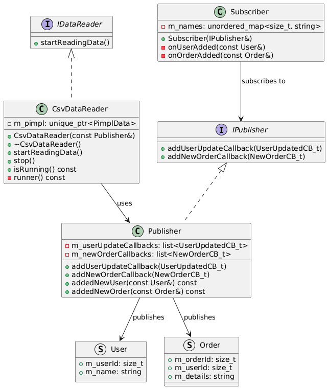
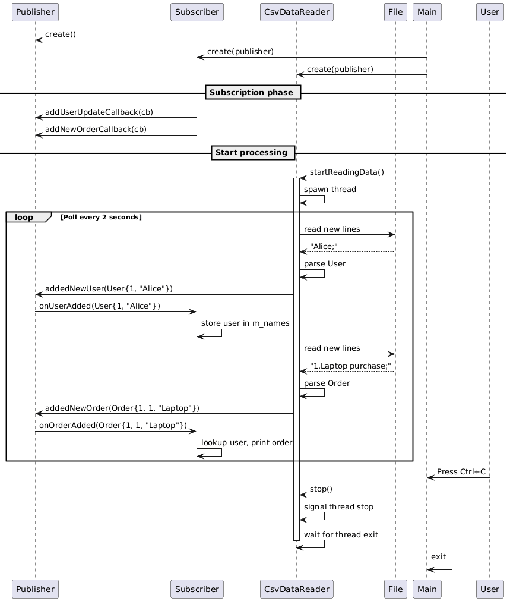

# PubSub (Phase 1)

This module demonstrates a callback-based Publisher-Subscriber implementation in C++17.

## What is Pub/Sub?

The Publisher-Subscriber pattern is a messaging paradigm where:
- **Publishers** emit events without knowing who will consume them
- **Subscribers** register callbacks to receive events they're interested in
- **Loose coupling**: Publishers and subscribers are independent

## When to Use Pub/Sub

**Good use cases:**
- Event logging and monitoring systems
- UI event handling (button clicks, notifications)
- Asynchronous workflows (file processing, data pipelines)
- Plugin architectures with unknown subscribers at compile-time
- Decoupling system components

**Not ideal for:**
- Direct request-response communication
- Performance-critical hot paths (callback overhead)
- Simple 1:1 communication (use direct calls)
- Guaranteed delivery requirements (needs queuing)

## Advantages

- **Decoupling**: Publishers don't depend on subscriber implementations
- **Extensibility**: Add new subscribers without modifying publishers
- **Runtime flexibility**: Subscribe/unsubscribe dynamically
- **Broadcast**: One event → multiple handlers

## Disadvantages

- **Debugging difficulty**: Event flow is implicit, harder to trace
- **Memory management**: Callbacks can create lifetime issues
- **No delivery guarantees**: Fire-and-forget model
- **Blocking callback chain**: The processing thread is blocked until all callbacks finish; slow handlers or downstream component calls can delay subsequent events
- **Performance**: Slower than direct calls or static dispatch

## Architecture

### Class Diagram



PlantUML source: [diagrams/pubsub-class-diagram.puml](diagrams/pubsub-class-diagram.puml)

### Sequence Diagram



PlantUML source: [diagrams/pubsub-sequence-diagram.puml](diagrams/pubsub-sequence-diagram.puml)

## Build and Run

### Prerequisites

- **CMake** 3.16 or higher
- **C++17** compatible compiler
- **macOS / Linux / Windows**

### Build

```bash
cd PubSub
mkdir -p build && cd build
cmake -DCMAKE_BUILD_TYPE=Debug ..
cmake --build . -j4
```

### Run

```bash
./PubSubExample
```

Press **Ctrl+C** to gracefully shut down.

## Quick Example

```cpp
#include "Publisher.hpp"
#include "Subscriber.hpp"
#include "CsvDataReader.hpp"

int main() {
    PubSub::Publisher publisher;
    PubSub::Subscriber subscriber(publisher);

    PubSub::CsvDataReader reader(publisher);
    reader.startReadingData();

    // Main thread waits for Ctrl+C...

    reader.stop();
    return 0;
}
```

The `Subscriber` prints events as they arrive.

## Testing Tip

While the application is running, append new entries to `Data/users.csv` and `Data/orders.csv`. The CSV reader keeps polling files and processes newly added lines when they end with `;`.
