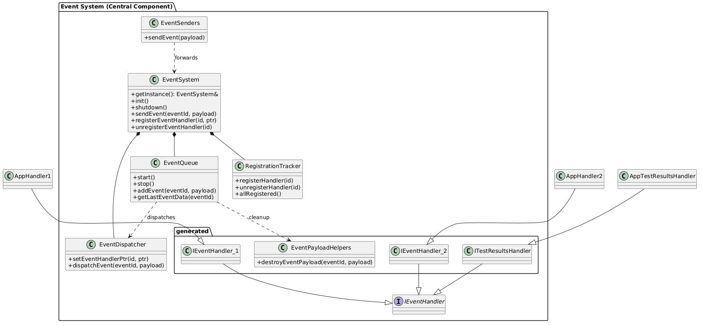
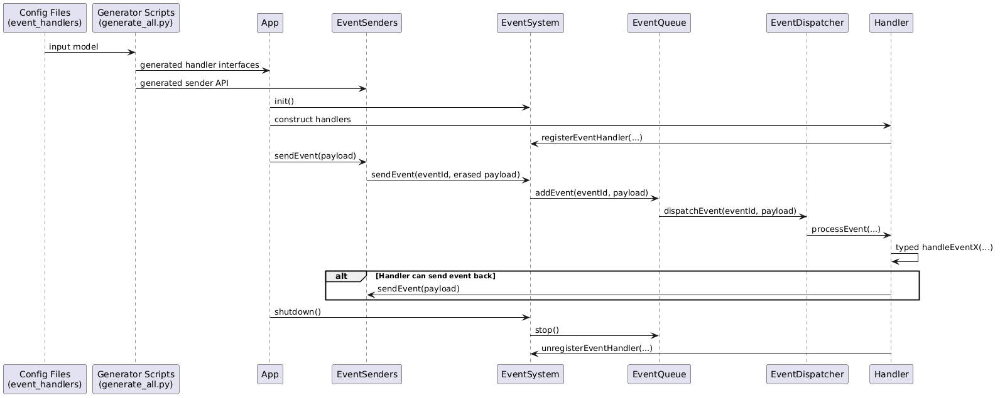

# Static Event System

This module is a generation-driven event system.

The main goal is to keep user-facing APIs small and clear while moving infrastructure complexity to generated code and core internals.

## Why this approach

Compared to runtime-only registration models, this design gives:
- Stronger compile-time contracts for handlers.
- Predictable startup semantics: system starts processing only after all expected handlers are registered.
- Cleaner user includes: user code mostly consumes `system/EventSenders.hpp`, generated handler interfaces, and payload types.

## High-Level Flow

1. JSON configs define event ids, payload types, queues, and handler subscriptions.
2. Python generators render C++ headers/sources from templates.
3. User handler classes inherit generated interfaces and implement typed `handleEvent...` methods.
4. User handlers self-register/unregister via helper API.
5. `EventSystem` routes events through queue + dispatcher to registered handlers.

## Core Components

This type of system has some similarities with [Dynamic Event System](../DynamicEventSystems/README.md)

- `EventSystem`
  - Public facade and lifecycle owner.
  - Coordinates dispatcher, queue, and registration tracker.

- `EventQueue`
  - Worker-thread queue and dispatch loop.
  - Stores last event payload per event type.

- `EventDispatcher`
  - Maps event id -> list of handler ids.
  - Calls handler `processEvent(...)` if registered.

- `RegistrationTracker`
  - Tracks which generated handlers are registered.
  - Declares `allRegistered()` and provides watchdog logging for missing handlers.

- Generated interfaces (`generated/include/handlers/*`)
  - One interface per configured handler.
  - Each interface has typed `handleEvent...` methods.

- Generated send API (`generated/include/system/EventSenders.hpp`)
  - User-oriented event send helpers.
  - Hides payload erasure details.

## Include Surface Layout

- User-oriented
  - `event_system/generated/include/system/EventSenders.hpp`
  - `event_system/include/system/EventSystem.hpp`
  - `event_system/generated/include/handlers/*`
  - `event_system/generated/include/types/*`

- Core/internal
  - `event_system/include/core/*`
  - `event_system/generated/include/core/*`

Only `EventSenders` stays in generated `system` include folder. Core ids and helpers are intentionally moved under `core`.

## Config Files and Why They Matter

Config directory: `event_system/configs`

- `events_enum.json`
  - Numeric event ids.
  - Source of generated enums for event ids.

- `events_types.json`
  - Payload type model and event -> payload mapping.
  - Drives generated payload type headers and sender/handler signatures.

- `event_handlers.json`
  - Handler names, subscriptions, queue assignments.
  - Drives generated handler interfaces and event-to-handler map builder.

Benefits of config-first setup:

- Single source of truth for event contracts.
- Repeatable generation with low manual drift.
- Easier review of API changes through JSON diffs.

## How to Implement Handlers

1. Generate interfaces.
2. In `app/include/app/handlers`, create concrete classes inheriting generated interfaces.
3. Implement all required typed `handleEvent...` methods.
4. Register in constructor, unregister in destructor.
5. Instantiate handlers in your top-level `App` object so their lifetime is process-scoped.

Typical pattern:

```cpp
class EventHandler1 final : protected event_system::IEventHandler_1
{
public:
    EventHandler1();
    ~EventHandler1();

private:
    void handleEventTimestamp(const event_system::Timestamp& payload) override;
    void handleEventEventSystemReady() override;
};
```

## Prerequisites

Code generation depends on Python and `Cheetah3`.

Install dependency:

```bash
python3 -m pip install Cheetah3
```

If you have multiple Python installations, CMake may pick an interpreter that does not have `Cheetah3` installed. In that case, set the interpreter explicitly:

```bash
cmake -S . -B build -DPython3_EXECUTABLE=/usr/bin/python3
```

Replace `/usr/bin/python3` with the Python executable where `Cheetah3` is installed.

## How to Generate Interfaces and Sources

From `event_system` directory:

```bash
python3 scripts/generate_all.py --root .
```

Or individually:

```bash
python3 scripts/generate_static_headers.py --root .
python3 scripts/generate_event_handlers_map_builder.py --root .
python3 scripts/generate_event_handlers.py --root .
```

## Build and Run

From `StaticEventSystem` directory:

```bash
cmake -S . -B build
cmake --build build
./build/app/test_app
```

Stop with `Ctrl+C` or 'Esc' Key.

## Building and Running Tests

To enable and build tests for StaticEventSystem, configure CMake with the following flag:

```
cmake -DBUILD_TESTING=ON ...
```

This will generate and build all test targets defined in the project. You can then run the tests using `ctest` or by executing the test binaries directly from the build directory.


## Memory Leak Checking (macOS)

To check for memory leaks using the built-in leaks tool on macOS, run:

```
leaks -atExit -- ./app/test_app
```

This will report any memory leaks detected after the application exits.

## Memory Leak Checking (Linux)

To check for memory leaks on Linux, use Valgrind:

```
valgrind --leak-check=full ./app/test_app
```

This will run your application and report any memory leaks detected after exit. Make sure Valgrind is installed (e.g., `sudo apt install valgrind`).

## Architecture

### Class Diagram



PlantUML source: [diagrams/static-class-diagram.puml](diagrams/static-class-diagram.puml)

### Sequence Diagram



PlantUML source: [diagrams/static-sequence-diagram.puml](diagrams/static-sequence-diagram.puml)

## Positive Sides

- Strong typed handler contracts.
- Deterministic startup gate through registration completeness.
- Cleaner user-facing include suggestions.
- Config-driven API evolution.

## Negative Sides / Risks

- Generation pipeline adds tooling complexity.
- Bad templates can break many generated files at once.
- Concurrency-sensitive internals still need careful hardening.
- Refactors require synchronized changes in scripts + templates + runtime.

## Shutdown Policy

StaticEventSystem uses discard semantics on shutdown:

- new events are rejected,
- queued but not yet dispatched events are discarded,
- worker thread stops without queue draining.

Decision rationale is captured in ADR:

- [docs/adr/0001-static-event-queue-stop-policy.md](../docs/adr/0001-static-event-queue-stop-policy.md)
- [docs/adr/0002-last-event-data-visitor-access.md](../docs/adr/0002-last-event-data-visitor-access.md)

## Can it be better?

Yes. Future improvements:

- Generate more runtime internals (queue and registration policy) from config.
- Add schema validation for config files before generation.
- Add CI checks to enforce generator determinism and compile outputs.
- Introduce integration tests for startup/shutdown and unregister semantics.
