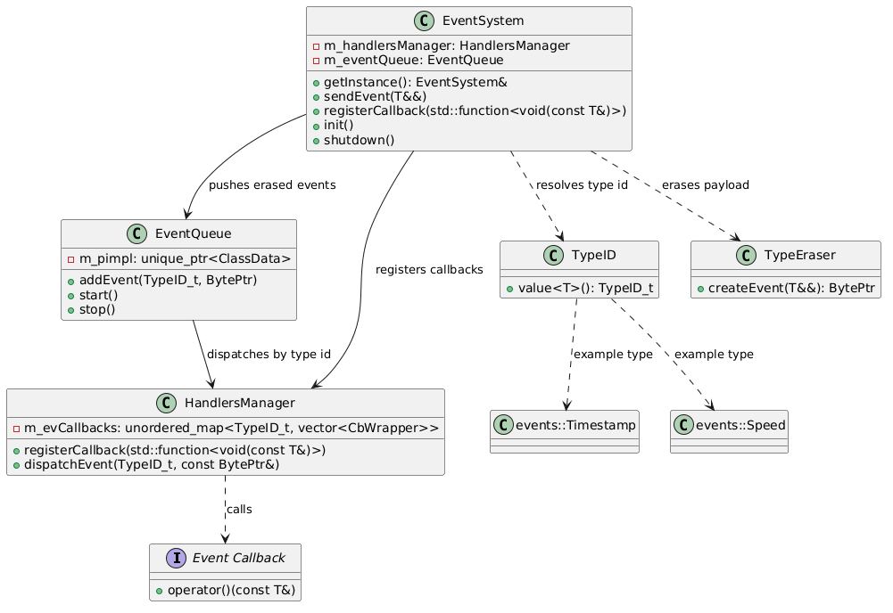
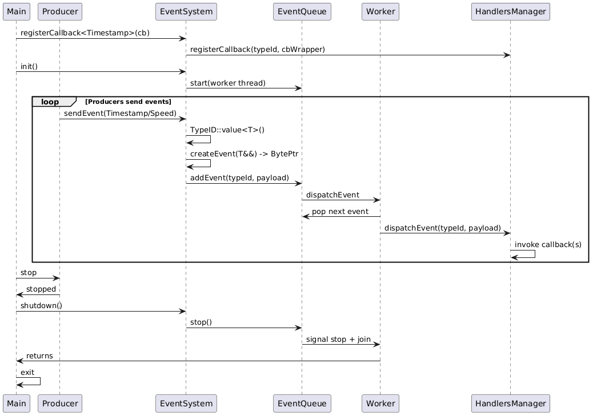

# Dynamic Event System

This module explores a runtime-typed event system with type erasure, asynchronous queue dispatch, and callback registration by event type.

## Overview

Current flow:
1. Producer calls `EventSystem::sendEvent`
2. Event type is mapped to a runtime `TypeID`
3. Payload is type-erased into `byte array`
4. Event is enqueued in `EventQueue`
5. Worker thread dispatches to `HandlersManager`
6. All registered callbacks for that type are invoked

## Architecture

### Class Diagram



### Sequence Diagram




## Positive Sides

- **Runtime extensibility**: New event types can be introduced without changing a central variant/union.
- **Decoupled architecture**: Producers, queue, and handlers are separated by clear responsibilities.
- **Asynchronous dispatch**: Event production is decoupled from callback execution via worker thread and queue.
- **Move-aware send path**: `sendEvent(T&&)` with forwarding supports efficient event transfer.
- **Deterministic lifecycle hooks**: `init()` and `shutdown()` make startup/shutdown explicit.

## Current Limitations / Negative Points

- **Duplicate callback auto-detection is not reliable**: Callback identity cannot be inferred robustly from generic `std::function` (especially lambdas with captures).
- **No full unregister flow yet**: Registration token/id and stable removal path are still TODO.
- **Startup registration overhead**: On each process start, callbacks must be registered at runtime before events can be fully dispatched; this adds startup work and can become noticeable in larger systems.
- **Stop behavior can drop queued events**: Current shutdown logic stops worker loop; pending events may remain undelivered.
- **Exception policy for callbacks is not finalized**: Throwing callbacks can affect thread/process behavior unless explicitly guarded.
- **Thread-safety boundaries are still evolving**: Concurrent callback registration and dispatch policies need to be finalized and tested.

## Where Dynamic Is Strong

- Event payload model can evolve without regenerating interfaces.
- Good for plugin-like systems where event sets are not closed at compile time.
- Useful as a migration stage between simple PubSub and strict static contracts.

## Where Dynamic Is Weak

- Runtime registration and erasure add operational/debug complexity.
- Invalid combinations are detected later than in static models.
- Harder to guarantee complete startup readiness compared to static registration-gates.

## Can We Do Better?

Yes. This implementation intentionally highlights where runtime flexibility helps and where it hurts.
If your priority is stronger compile-time contracts and cleaner consumer APIs, see the [Static Event System](StaticES.md)

## Callback Registration Policy

For this implementation phase, callback registrations are treated as explicit subscriptions:
- Registration adds a new callback entry.
- Automatic deduplication by callback identity is intentionally not guaranteed.
- Preferred long-term approach: use explicit subscription id/token returned by registration and unregister by that id.
- To keep dispatch on the fast path (no callback-copy on each event), callback registration is a bit stricter: avoid registering/unregistering concurrently with active dispatch unless additional synchronization is introduced.

## Build and Run

```bash
cd DynamicEventSystems
mkdir -p build && cd build
cmake -DCMAKE_BUILD_TYPE=Debug ..
cmake --build .
./DynamicEventSystem
```

## Example Events

Defined in `events/events.hpp`:
- `events::Timestamp`
- `events::Speed`
